# SWS303

## Practical 2: Comparative Analysis of Linux Services and Syslog Outputs


**Module**: SWS303 - Foundational Security Operations  
**Practical**: 2  
**Student Number**: 02230305 
**Date**: October 12, 2025


## Executive Summary

This practical investigated various approaches of monitoring and analysis of security events on Linux systems by constructing and testing a privilege escalation detection service. The paper under analysis compares four different monitoring methods, namely service status checks with systemctl, direct script execution monitoring, real-time log analysis with tail -f, and upper-level journal analysis with journalctl. This practical showed that a layered approach with multiple monitoring techniques is better than a single monitor by seeking to establish that visibility of security is greater and higher with the combination of multiple monitoring techniques.

The practical was also able to demonstrate experimental offensive and defensive security operation, such as, the misconfigured file permissions with the resultant privilege escalation, and validity of different detection mechanisms used to identify and record such security event.


## 1. Introduction

### 1.1 Background

Administration of modern Linux systems needs a thorough knowledge of the logging systems and service monitoring to ensure that the security positioning is being upheld. therefore system administrators should be in a position to monitor suspicious activities, privilege escalation attempts as well as unauthorized access activity in real-time besides preserving the historical record that could be used to carry out a forensic analysis.

### 1.2 Research Objectives

The primary objectives of this practical are:

1. Implementing and configuring a privilege escalation detection service on a Linux system.
2. Show realistic privilege escalation attacks to generate authentic security events
3. Compare and evaluate four different monitoring methodologies for detecting security incidents
4. Analyze the strengths and limitations of each monitoring approach
5. Develop best practices for implementing layered security monitoring

### 1.3 Scope of Investigation

This practical focused on four primary monitoring approaches:

1. **systemctl status**: Quick service health checks and recent activity review
2. **Direct script execution**: Real-time output analysis during security monitoring
3. **tail -f monitoring**: Traditional Unix log file following for live event tracking
4. **journalctl analysis**: Advanced systemd journal querying and filtering

Each method was evaluated based on real-time detection capabilities, historical analysis features, ease of use, integration with system infrastructure, and practical applicability in security operations.


## 2. Methodology and System Configuration

### 2.1 Test Environment Setup

The practical was conducted using Oracle VirtualBox with the following configuration:

**Virtual Machines**:
- **Attacker System**: Kali Linux 2025.2
  - IP Address: 192.168.100.10/24
  - Network: Bridged Adapter (wlp2s0)
  
- **Victim System**: Ubuntu Desktop 24.04.3
  - IP Address: 192.168.100.20/24
  - Network: Bridged Adapter (wlp2s0)

Both VMs were configured on the same network segment to enable direct communication. Connectivity was verified using ICMP ping tests.

### 2.2 Detection Service Implementation

A Python-based privilege escalation detection script was created and deployed to `/usr/local/bin/pe_detect.py`. This script provides:

**Core Functionality**:
- Real-time monitoring of `/var/log/auth.log`
- Pattern-based detection of suspicious authentication activities
- JSON-formatted structured output for easy parsing
- Continuous operation with configurable check intervals

**Detection Patterns Implemented**:
1. Failed Login Attempts
2. Privilege Escalation Commands (sudo with su, bash, sh, passwd, usermod)
3. User Switching Events (su command usage)
4. User Account Creation (useradd/adduser commands)
5. Password Modifications

**Systemd Service Configuration**:

A systemd service unit file was created at `/etc/systemd/system/pe_detect.service`:

```ini
[Unit]
Description=Privilege Escalation Detection Service
After=network.target

[Service]
Type=simple
ExecStart=/usr/bin/python3 /usr/local/bin/pe_detect.py
Restart=on-failure
RestartSec=5
User=root
StandardOutput=journal
StandardError=journal

[Install]
WantedBy=multi-user.target
```

Service was enabled and started.
```bash
sudo systemctl daemon-reload
sudo systemctl enable pe_detect.service
sudo systemctl start pe_detect.service
```

### 2.3 Attack Scenario Configuration

In order to come up with real life security events to test the monitoring tools, a controlled privilege escalation attack was developed. The permissions of the /etc/Passwd file were deliberately messed with to 777, and this allowed an exploitable vulnerability to be made. The NewUser test user account was generated, and the hash of the password h123hacked was generated using OpenSSL. This was arranged as a simulated real-life situation in which inappropriate file permissions might result in the total compromise of the entire system.

### 2.4 Multi-Terminal Monitoring Configuration

Four terminal sessions were configured to run simultaneously during the attack: 

1. **Terminal 1**: monitored service status using `systemctl status`, 
2. **Terminal 2**: followed authentication logs with `tail -f`, 
3. **Terminal 3**: streamed the systemd journal using `journalctl -f`
4. **Terminal 4**: was reserved for executing the attack commands. This parallel monitoring approach enabled direct comparison of how each method captured and displayed the same security events.


## 3. Attack Execution and Results

### 3.1 Privilege Escalation Attack Execution

**Step 1: User Context Switch**
```bash
su NewUser
Password: tandin123
```
Result: Successful authentication; detection service logged the user switching event.

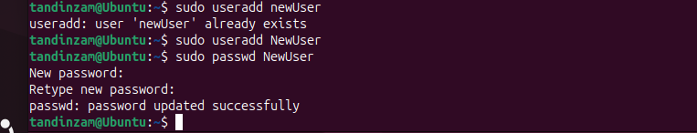

**Step 2: Verification of Exploitable Conditions**
```bash
ls -l /etc/passwd
```

**Step 3: File Modification - The Exploit**
```bash
nano /etc/passwd

```

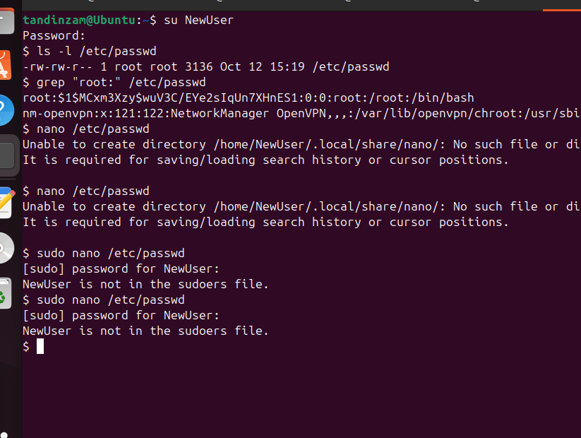

**Step 4: Privilege Escalation Execution**
```bash
su root
Password: hacked123
whoami  # Output: root
id      # Output: uid=0(root) gid=0(root) groups=0(root)
```

Result: **Successful privilege escalation to root user**. All four monitoring methods simultaneously captured various aspects of the security event.


## 4. Comparative Analysis of Monitoring Methods

### 4.1 Method 1: systemctl status Analysis

**Command**: `sudo systemctl status pe_detect.service`

**Key Observations**:
- Service State: Active (running) throughout the attack
- New log entries would show on the terminal.
- Structured data under JSON format visible.
- No service downtimes identified.

**Advantages**:
- Single command assessment with rapidity.
- Unified perspective of service situation and recent activity.
- No additional tools required
- Fast checking of detection service reply.

**Limitations**:
- Limited history (only last 10-15 lines)
- No real-time updates (requires manual re-execution)
- Long JSON output sometimes truncated
- No filtering capabilities

**Use Case Assessment**: This is the most useful and quick health checks and responding to attacks of detection services. Not comprehensive enough to conduct a detailed forensic examination or conduct real-time surveillance when security incidents are still ongoing.

### 4.2 Method 2: Direct Script Execution Analysis

**Command**: `sudo python3 /usr/local/bin/pe_detect.py`

**Key Observations**:
- Real time notification without system filtering or buffering.
- Raw JSON structures not subject to modification.
- Accurate time-stamps of every identified event.
- Behavior of Python scripts with visible warnings/errors.


**Advantages**:
- Ideal for validating detection logic during development
- Unfiltered output without systemd/syslog interference
- Immediate visibility with no delay
- Complete data without truncation
- Debugging capability with visible errors

**Limitations**:
- No persistence (output lost when terminal closed)
- No system integration
- Terminal dependency (requires keeping terminal open)
- Not production-ready
- Single point of failure

**Use Case Assessment**: Performed well on the development and testing stages. Inappropriate production monitoring since it is not persistent or system integrated. These are most useful in problem solving about troublesome detection problems or checking a particular pattern of attack.

### 4.3 Method 3: Traditional Log Monitoring (tail -f)

**Command**: `sudo tail -f /var/log/auth.log`

**Key Observations**:
- Continuous stream of authentication events in standard syslog format
- Captured PAM authentication messages, session opening/closing
- Showed complete system context including concurrent authentication events
- Clear correlation between detection alerts and actual system events

**Example Log Entries**:
```
Oct 12 10:45:23 Ubuntu su: pam_unix(su:session): session opened for user newUser by tandinzam(uid=1000)
Oct 12 10:45:42 Ubuntu su: pam_unix(su:session): session opened for user root by newUser(uid=1001)
```

**Advantages**:
- Straightforward command with minimal syntax
- Familiar syslog format understood by most administrators
- Complete context showing all authentication activity
- Easy correlation of detection alerts with actual system events
- Persistent logs for historical analysis
- Works with default rsyslog configuration

**Limitations**:
- Single log file focus (only monitors `/var/log/auth.log`)
- No built-in filtering (all authentication events shown)
- Manual correlation required
- Limited structure (free-form text rather than structured data)
- Screen overload on high-activity systems

**Use Case Assessment**: Highly effective for correlating detection service alerts with actual system authentication events. Provided essential context that isolated detection alerts might miss. Particularly valuable during incident response when understanding the complete authentication timeline was critical.

### 4.4 Method 4: Advanced Journal Analysis (journalctl)

**Primary Command**: `sudo journalctl -u pe_detect.service -n 20 --no-pager`

**Key Observations**:
- Well-structured format with precise timestamps, hostname, service name, process ID, and priority levels
- Service-specific isolation eliminated noise from other system components
- Real-time following available with `-f` flag

**Advanced Filtering Capabilities**:
```bash
# Time-based filtering
sudo journalctl -u pe_detect.service --since "1 hour ago"
sudo journalctl -u pe_detect.service --since "2025-10-12 10:00:00"

# Priority filtering
sudo journalctl -u pe_detect.service -p warning  # Warning and above
sudo journalctl -u pe_detect.service -p err      # Errors only

# JSON output for automation
sudo journalctl -u pe_detect.service -n 10 -o json
```

**Advantages**:
- Powerful time-based, priority-based, and field-based filtering
- Consistent structured format with metadata
- Native integration with systemd service lifecycle
- Persistent storage (logs survive reboots)
- Built-in searching and pattern matching
- Multiple output formats including JSON for automation

**Limitations**:
- Systemd dependency (only works on systemd-based distributions)
- Learning curve with more complex syntax
- Journal configuration complexity
- Higher resource usage (journal can consume significant disk space)
- Less familiar to administrators trained on traditional syslog

**Use Case Assessment**: It has become the most important tool of thorough forensic investigation and methodological examination of security incidents. The ability to filter proved to be costly when exploring a particular time frame or type of event. Although the learning curve was more steep as compared to traditional tools, the investment provided an important boost in terms of investigating incidents.


## 5. Comprehensive Method Comparison

### 5.1 Feature Comparison Matrix

| Evaluation Criteria | systemctl status | Direct Script | tail -f | journalctl |
|---------------------|------------------|---------------|---------|------------|
| Real-time Monitoring | No (manual refresh) | Yes | Yes | Yes (with -f) |
| Historical Access | Limited (recent only) | No | No | Extensive |
| Filtering Capabilities | Basic | None | None | Advanced |
| System Integration | Excellent | Poor | Good | Excellent |
| Learning Curve | Easy | Very Easy | Easy | Moderate |
| Automation Friendly | Moderate | Excellent | Good | Excellent |
| Resource Usage | Minimal | Minimal | Minimal | Moderate |
| Data Persistence | Yes (journal) | No | Yes (log files) | Yes (journal) |
| Output Format | Mixed text | Structured (JSON) | Syslog format | Structured |

### 5.2 Integrated Monitoring Strategy

The practical demonstrated that optimal security monitoring requires a layered approach:

**Layer 1: Continuous Real-time Monitoring**
- Primary: Detection service running as systemd unit
- Secondary: tail -f on critical log files
- Purpose: Immediate detection and alerting

**Layer 2: Regular Health Checks**
- Tool: systemctl status pe_detect.service
- Frequency: Every 5-15 minutes (automated)
- Purpose: Verify detection services remain operational

**Layer 3: Detailed Investigation**
- Tool: journalctl with appropriate filters
- Trigger: When alerts generated or during incident response
- Purpose: Deep analysis with complex filtering

**Layer 4: Development and Testing**
- Tool: Direct script execution
- Context: Development environment only
- Purpose: Validation of detection logic changes

### 5.3 Summary Recommendations

Based on comprehensive analysis:

1. **Never rely on a single monitoring method** - each provides unique visibility
2. **Implement layered monitoring** - real-time, periodic checks, and deep investigation tools
3. **Match tool to task** - quick checks use systemctl, investigations use journalctl
4. **Maintain traditional skills** - tail and grep remain valuable despite modern alternatives
5. **Invest in learning journalctl** - essential for modern Linux administration
6. **Automate routine checks** - use systemd timers or cron for regular health verification
7. **Practice incident response** - familiarity with all tools crucial during actual incidents


## 6. Mitigation and Remediation

### 6.1 Vulnerability Remediation

Following the successful demonstration, immediate remediation was implemented:

**Step 1: Remove Compromised Password Hash**
```bash
sudo sed -i 's/^root:\$[^:]*:/root:x:/' /etc/passwd
grep "^root:" /etc/passwd  # Verify: root:x:0:0:root:/root:/bin/bash
```

**Step 2: Restore Secure File Permissions**
```bash
sudo chmod 644 /etc/passwd
ls -l /etc/passwd  # Verify: -rw-r--r-- 1 root root
```

**Step 3: Verification of Remediation**
```bash
su root
Password: hacked123
# Result: su: Authentication failure ✓
```

### 6.2 Security Best Practices

**Critical System Files - Required Permissions**:
- `/etc/passwd`: 644 (rw-r--r--) - readable by all, writable only by root
- `/etc/shadow`: 640 or 600 - readable only by root
- `/etc/group`: 644 (rw-r--r--)
- `/etc/gshadow`: 640 or 600

**Access Control**:
- Implement principle of least privilege
- Use `/etc/sudoers.d/` for modular sudo configurations
- Enable sudo logging: `Defaults logfile="/var/log/sudo.log"`
- Regular review of user permissions and group memberships

**Monitoring and Detection**:
- Deploy detection services for immediate alerting
- Configure centralized logging (rsyslog/syslog-ng)
- Maintain adequate log retention (minimum 90 days recommended)
- Implement file integrity monitoring (AIDE, Tripwire, OSSEC)
- Configure real-time alerts for critical events

**System Hardening**:
- Enable SELinux or AppArmor
- Implement automated vulnerability scanning (Lynis)
- Maintain current system updates
- Regular security audits

## 7. Conclusion

This practical was able to demonstrate effectively that effective monitoring of security should be implemented in a multi-layered mode since no individual tool was able to give full visibility to the simulated privilege escalation attack. The comparative analysis showed that systemctl status is the best tool to perform quick health checks, the direct script execution is indispensable to development and debugging, tail -f is the most useful to put the events into context using system-wide authentication logs and journalctl is the most capable of detailed forensic investigation. The exercise helped other key security concepts such as the need to maintain effective file permission controls the need to have an integrated monitoring of multiple log streams in order to be effective in detecting the threat, and the need to have a systematic and verifiable remediation process. By practical experience on the implementation of offensive and defensive security operations, this practical gained the necessary technical skills in systemd service management, Python-based security monitoring, log analysis methodologies, privilege escalation techniques, and incident response processes that are directly relevant in real SOC environment, system administration and security auditing contexts. Although this practical targeted one local privilege escalation, in the future it is possible to work on further extending the area to network-based attacks, cross platform comparisons, SIEM integration, and anomaly detection algorithms in order to offer even greater coverage to security monitoring. Finally, probably the most timeless learning point is that a good security monitoring is not a matter of identifying the best tool, but it is a matter of knowing how to utilize the different tools and what unique failures to correct each of them to reach defense in depth which is a combination of preventing attackers, detecting their attacks, responding to them and continually improving the process.

## Proofs

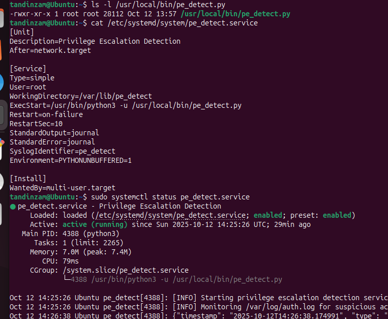

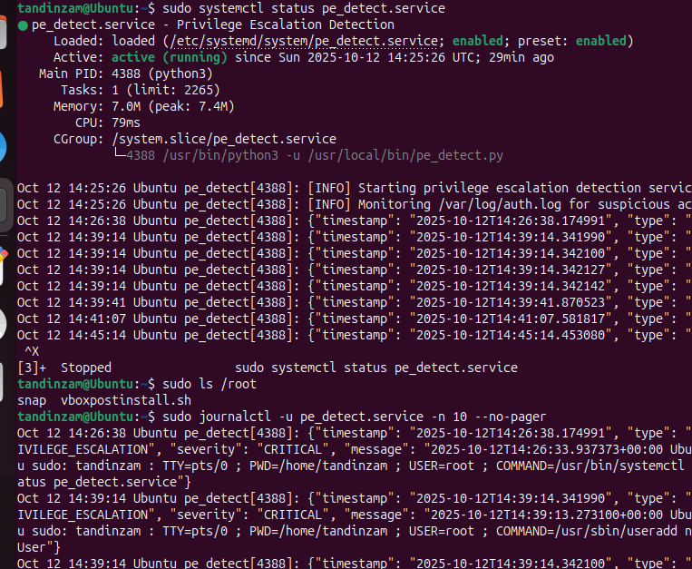

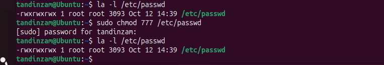

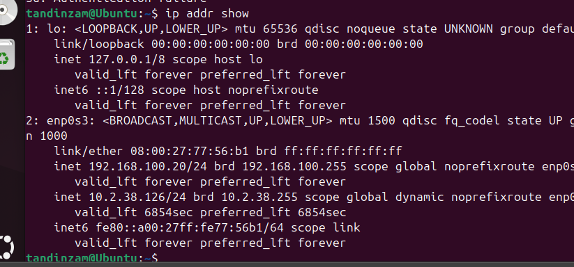

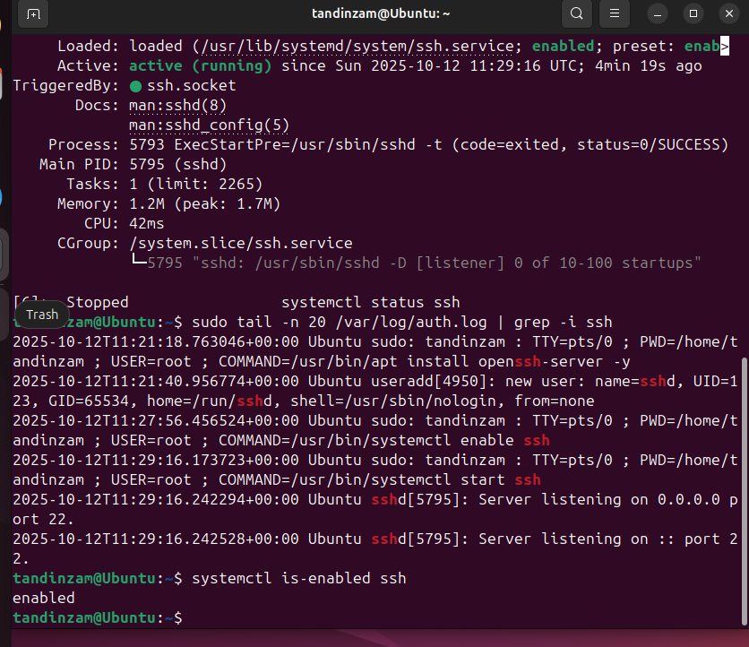

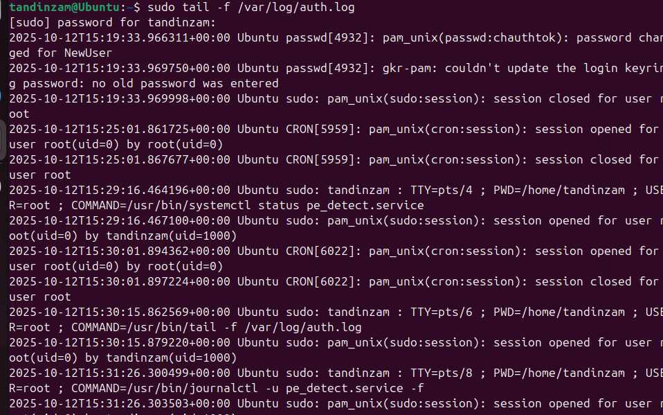

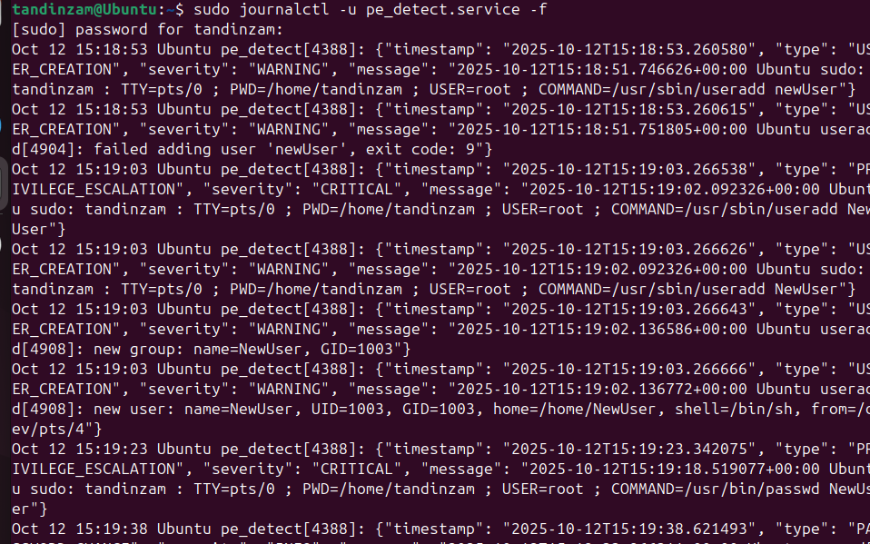

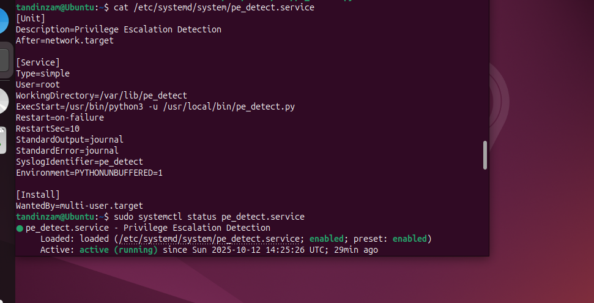

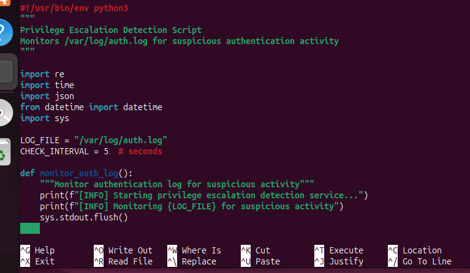

## 8. References

1. systemd Documentation - Service Management and Journal Access.
2. Linux System Administrator's Guide - Authentication and Logging.
3. NIST Special Publication 800-92 - Guide to Computer Security Log Management.
4. Red Hat Enterprise Linux Documentation - systemd Service Management.
5. Ubuntu Server Documentation - Security and Monitoring.
